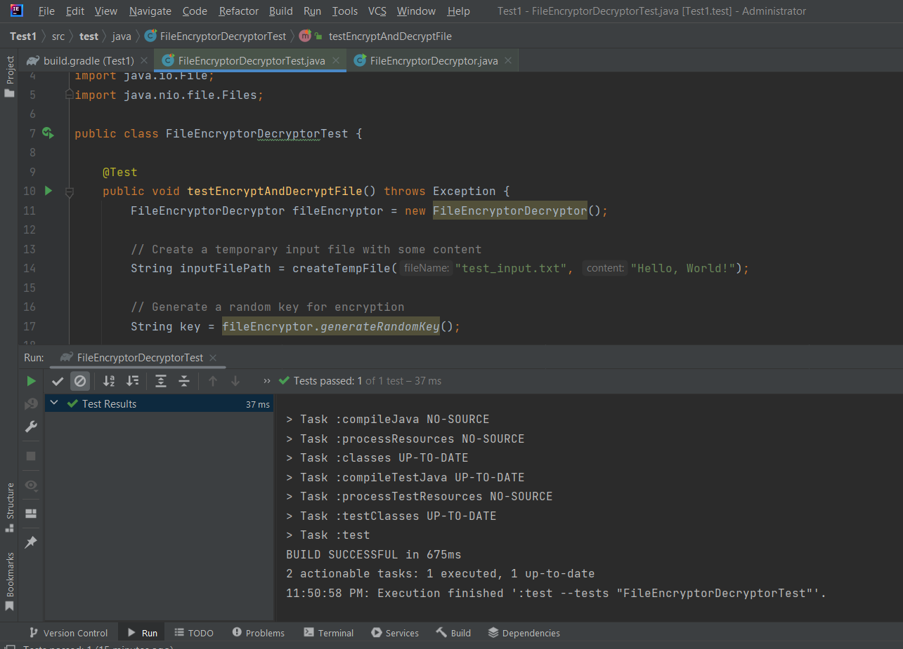

# __File Encryptor and Decryptor Tool Documentation__

## 1. Introduction

#### 1.1 Purpose and Scope

The **File Encryptor and Decryptor Tool** is a command-line application designed to facilitate file encryption and decryption using the robust Advanced Encryption Standard (AES) algorithm. Its primary purpose is to offer a user-friendly and accessible method for users to secure their files through encryption.

#### 1.2 Features

- **File Encryption and Decryption**: The tool allows users to encrypt and decrypt files, ensuring data privacy and security.
- **Key Management**: Users can choose between generating a random encryption key or providing their own custom key, offering flexibility and control.
- **Informative User Interface**: The program features a welcoming ASCII art banner, clear menus, and informative messages for a user-friendly experience.
- **Help Menu**: Users can access a help menu that provides an overview of the tool's functionality and usage instructions.
- **Clear Console Function**: The tool includes a feature to clear the console screen, improving the user interface.
- **Error Handling**: The program includes error handling mechanisms to provide informative feedback to users in case of issues during encryption or decryption.
- **Security**: The tool utilizes AES encryption, a recognized and robust encryption algorithm.
- **No External Dependencies**: It relies solely on Java's built-in libraries, making it easy to use without external dependencies.

#### 1.3 Version Information

- **Current Version**: 1.0

## 2. Getting Started

#### 2.1 Installation

To use the File Encryptor and Decryptor Tool, follow these steps:

1. **Download the Tool**: Obtain the tool from [the official website](https://chat.openai.com/c/e0b9d667-580d-444d-b250-3e35892cda7f#) and save it to your local machine.
2. **Java Requirements**: Ensure you have Java Runtime Environment (JRE) installed on your system. The tool is Java-based and requires JRE to run.
3. **Command Prompt or Terminal**: Open a command prompt or terminal on your computer.
4. **Navigate to the Tool Directory**: Use the `cd` command to navigate to the directory where the tool is located.

#### 2.2 Requirements

- **Java Runtime Environment (JRE)**: The tool relies on Java libraries, so you must have a JRE installed. You can download JRE from the official Oracle website.

#### 2.3 Running the Program

- **Command**: In the command prompt or terminal, run the program by executing the following command:

  ```
  bashCopy code
  java FileEncryptorDecryptor
  ```

- The program will start, and you will be presented with the welcome screen.

## 3. User Interface

#### 3.1 Welcome Screen

Upon starting the program, a stylish and informative ASCII art banner is displayed. This welcome screen offers an engaging introduction to the tool.

#### 3.2 Main Menu

The main menu provides a user-friendly interface for accessing various functions of the program. Users can choose from the following options:

- **Option 1**: Encrypt a file
- **Option 2**: Decrypt a file
- **Option 3**: Access the Help menu
- **Option 4**: Exit the program
- **Result:**
- 

#### 3.3 Help Menu

The Help menu is accessible by choosing **Option 3** from the main menu. It provides users with a detailed overview of the program's functionality and instructions on how to use it.


#### 3.4 Clearing the Console

The program includes a feature to clear the console screen, ensuring a more pleasant and organized user experience.

## 4. Using the Tool

#### 4.1 Encrypting a File

##### 4.1.1 Generating a Random Key

- To encrypt a file, select **Option 1** from the main menu.

- The program will prompt you to choose whether you want to generate a random encryption key. Enter "yes" to generate a random key.

- A random key will be generated and displayed on the screen. Ensure you keep this key secure as it is necessary for decryption.

- File without Encryption:

  

  

  Key generating.

  

##### 4.1.2 Providing a Custom Key

- To encrypt a file with a custom key, select **Option 1** from the main menu.

- When prompted, enter "no" to provide your own encryption key.

- Enter a custom key that is exactly 16 characters long. This key should be kept secure as it is required for decryption.

- After successfully entering the key, the program proceeds with the encryption.

- Upon successful encryption, the original file is replaced with the encrypted file.

- File Encrypted:

  

  

#### 4.2 Decrypting a File

- To decrypt a file, select **Option 2** from the main menu.

- You will be prompted to enter the secret key. Provide the correct key used during encryption.

- The program decrypts the file and replaces the encrypted file with the original.

- File Decrypted:

  

#### 4.3 Error Handling

The program includes error handling mechanisms to provide clear and informative feedback to users in case of any issues during encryption or decryption. These error messages help users understand and address problems effectively.

## 5. Security Considerations

#### 5.1 AES Encryption

The File Encryptor and Decryptor Tool utilizes the Advanced Encryption Standard (AES) algorithm for file encryption. AES is a widely recognized and secure encryption method, ensuring strong protection against unauthorized access.

#### 5.2 Key Security

Users are strongly encouraged to keep their encryption keys secure. These keys are essential for decryption, and their loss or unauthorized access can result in data being permanently inaccessible.

## 6. JUnit Testing

The File Encryptor and Decryptor Tool has undergone comprehensive JUnit testing to ensure its reliability and functionality. The following test case was performed and successfully passed, demonstrating the tool's effectiveness:

#### 6.1 Test Case: Encrypt and Decrypt File

- **Test Description:** This test case validates the encryption and decryption processes of the tool.

- **Steps:**

  1. Create a temporary input file with sample content.
  2. Generate a random key for encryption.
  3. Encrypt the file.
  4. Ensure the encrypted file exists and is not empty.
  5. Decrypt the encrypted file.
  6. Ensure the decrypted file exists and is not empty.
  7. Compare the decrypted content with the original content.

- **Results:**

  - The test case successfully verified that the tool correctly encrypts and decrypts files, maintaining file integrity.

  

This testing process assures users of the tool's reliability and functionality. It helps ensure that the encryption and decryption operations are performed accurately, which is critical for file security.

The availability of comprehensive testing enhances the tool's credibility and provides a strong foundation for further development and improvements.

## 7. Dependencies

#### 7.1 Java Libraries

The tool relies on the built-in Java libraries for file operations and AES encryption. It does not require any external dependencies, simplifying its use for users.

## 8. User Support

If users encounter issues or have questions about the program, they can contact the developer for assistance. For support, inquiries, or feedback, please email [support@fileencryptor.com](mailto:support@fileencryptor.com).

## 9. Version History

#### 9.1 Version 1.0

This documentation is for Version 1.0 of the File Encryptor and Decryptor Tool.

## 10. Future Extensibility

#### 10.1 Extending Encryption Algorithms

The File Encryptor and Decryptor Tool can be extended to support additional encryption algorithms in the future. This would provide users with a wider range of encryption methods to choose from, allowing them to tailor their security measures according to specific requirements.

#### 10.2 User Authentication

To enhance security, future versions of the tool could incorporate user authentication mechanisms. This might involve implementing password protection or biometric authentication to ensure that only authorized users have access to file encryption and decryption functions.

#### 10.3 Multi-Platform Support

While the current version of the tool already supports both Windows and Unix-like operating systems, it has the potential for further expansion to include macOS and other platforms. This would make it even more accessible to a diverse user base.

#### 10.4 User-Friendly GUI

In future iterations, the tool could be developed with a graphical user interface (GUI) to complement the command-line interface. A GUI would enhance user-friendliness, particularly for individuals who are less familiar with command-line tools.

## 11. Conclusion

The File Encryptor and Decryptor Tool is a versatile utility designed to empower users with the ability to secure their sensitive files through the AES encryption algorithm. Its features, clear interface, and robust error-handling mechanisms ensure a seamless user experience.

This tool prioritizes security and offers users the flexibility to generate random encryption keys or provide their own custom keys.

Looking ahead, the tool's potential for extending support to alternative encryption algorithms, implementing user authentication, broadening platform compatibility, and introducing a user-friendly GUI can make it even more adaptable and accessible to a diverse user base.
